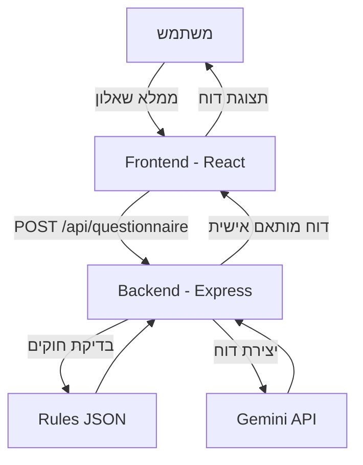

# Technical Documentation – Business Licensing Evaluation System

---

## 1. ארכיטקטורת המערכת

המערכת בנויה משלושה חלקים עיקריים:

- **Frontend (React)**  
  מציג שאלון למשתמש, שולח את הנתונים לשרת ומציג את הדו"ח המותאם שהתקבל מה־AI.

- **Backend (Node.js + Express)**  
  מקבל את נתוני השאלון, מבצע ולידציה (Joi), משווה מול החוקים (`rules.json`) ושולח בקשה ל־AI.

- **AI Integration (Gemini)**  
  מעבד את נתוני העסק והחוקים המתאימים ומחזיר דו"ח רגולטורי ברור בעברית.

### דיאגרמת זרימה (Mermaid)



---

## 2. תיעוד API

### נקודת קצה: `POST /api/questionnaire`

#### בקשה

```json
{
  "bizName": "מסעדת טעים",
  "bizSize": 120,
  "seats": 150,
  "alcohol": false,
  "servingFood": true,
  "gas": true
}
```

#### תגובת הצלחה (200)

```json
{
  "matchedRules": [
    {
      "id": "SEATING_LTE_200",
      "condition": {
        "seating_lte": 200,
        "alcohol": false
      },
      "requirement": "עסק עד 200 מקומות ישיבה ללא מכירת/הגשת/צריכת אלכוהול פטור מדרישות מסוימות"
    },
    {
      "id": "FEATURE_HOT_PREP",
      "condition": {
        "features": ["meat", "fish"]
      },
      "requirement": "לבשל בשר/עופות/דגים עד חימום מלא (72°C למשך 2 דקות בנקודה הקרה), לקרר במהירות אם מוגש קר, ולאחסן בטמפרטורות מתאימות"
    },
    {
      "id": "FEATURE_GAS_LPG",
      "condition": {
        "features": ["gas"]
      },
      "requirement": "מערכת גפ\"מ וציוד נלווים במצב תקין ומתוחזק; לשמור בעסק אישורים (מטפים לפי ת\"י 129/1, בדיקת חשמל/תאורות חירום)."
    }
  ],
  "aiReport": "העסק עומד ברוב הדרישות, מומלץ להשלים את אישור כיבוי האש..."
}
```

#### תגובת שגיאה (400)

```json
{
  "errors": [{ "field": "bizName", "message": "שם העסק הוא שדה חובה" }]
}
```

#### תגובת שגיאה (500)

```json
{
  "message": "Internal Server Error",
  "error": "Something went wrong"
}
```

---

## 3. מבנה נתונים

### Rules JSON (חוקים לדוגמה)

```json
[
  {
    "id": "SEATING_LTE_200",
    "condition": {
      "seating_lte": 200,
      "alcohol": false
    },
    "requirement": "עסק עד 200 מקומות ישיבה ללא מכירת/הגשת/צריכת אלכוהול פטור מדרישות מסוימות"
  },
  {
    "id": "FEATURE_HOT_PREP",
    "condition": {
      "features": ["meat", "fish"]
    },
    "requirement": "לבשל בשר/עופות/דגים עד חימום מלא (72°C למשך 2 דקות בנקודה הקרה), לקרר במהירות אם מוגש קר, ולאחסן בטמפרטורות מתאימות"
  },
  {
    "id": "FEATURE_GAS_LPG",
    "condition": {
      "features": ["gas"]
    },
    "requirement": "מערכת גפ\"מ וציוד נלווים במצב תקין ומתוחזק; לשמור בעסק אישורים (מטפים לפי ת\"י 129/1, בדיקת חשמל/תאורות חירום)."
  }
]
```

### סכמה (Joi Validation)

```javascript
{
        bizName: joi.string().required().min(2).messages({
          "string.empty": "שם העסק הוא שדה חובה",
          "string.min": "שם העסק חייב להכיל לפחות 2 תווים",
        }),
        bizSize: joi.number().min(1).required().messages({
          "number.base": "גודל העסק חייב להיות מספר",
          "number.min": "גודל העסק לא יכול להיות שלילי או שווה ל-0",
          "any.required": "גודל העסק הוא שדה חובה",
        }),
        seats: joi.number().min(0).required().messages({
          "number.base": "מספר מקומות חייב להיות מספר",
          "number.min": "מספר מקומות לא יכול להיות שלילי",
          "any.required": "מספר מקומות הוא שדה חובה",
        }),
        servingFood: joi.boolean().required(),
        gas: joi.boolean().required(),
        alcohol: joi.boolean().required(),
      }
```

---

## 4. אלגוריתם ההתאמה

### שלבים:

1. המערכת מקבלת את נתוני השאלון מהמשתמש.
2. הפונקציה `matchRules` משווה בין נתוני העסק לבין התנאים בקובץ `rules.json`.
3. כל חוק שהתקיים – נוסף לרשימת החוקים הרלוונטיים (`matchedRules`).
4. רשימת החוקים יחד עם נתוני העסק נשלחת למודל ה־AI (Gemini).
5. המודל מחזיר דו"ח ברור בעברית הכולל:
   - סעיפים שהתקיימו
   - סעיפים חסרים
   - המלצות פעולה

---

מסמך זה משלים את ה־README הראשי ומספק תמונה טכנית מלאה של המערכת.
